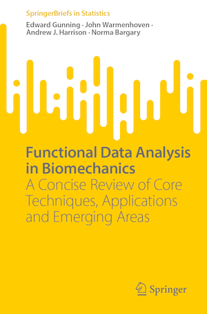

From [book website](https://link.springer.com/book/9783031688614):

* The first book on the use of functional data analysis in biomechanics

* Reviews core techniques, applications and emerging areas, providing R code for implementation
    
* Authored by an inter-disciplinary group of world-leaders in both biomechanics and statistics

# About this book

This book provides a concise discussion of fundamental functional data analysis (FDA) techniques for analysing biomechanical data, along with an up-to-date review of their applications. The core of the book covers smoothing, registration, visualisation, functional principal components analysis and functional regression, framed in the context of the challenges posed by biomechanical data and accompanied by an extensive case study and reproducible examples using R. This book proposes future directions based on recently published methodological advancements in FDA and emerging sources of data in biomechanics. This is a vibrant research area, at the intersection of applied statistics, or more generally, data science, and biomechanics and human movement research. This book serves as both a contextual literature review of FDA applications in biomechanics and as an introduction to FDA techniques for applied researchers. In particular, it provides a valuable resource for biomechanics researchers seeking to broaden or deepen their FDA knowledge.
